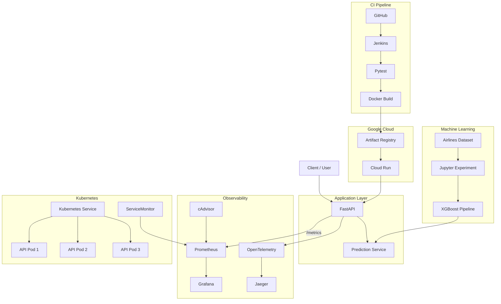

# ✈️ Flight Delay Prediction MLOps

An end-to-end MLOps project for predicting whether a scheduled flight will be delayed.

The project covers the complete machine learning lifecycle:

**Experimentation → Model Training → API Serving → Containerization → Monitoring → Tracing → CI/CD → Kubernetes → Cloud Deployment**

## Live API

Google Cloud Run:

```text
https://flight-delay-api-yphxzrqgoa-as.a.run.app
```

Swagger UI:

```text
https://flight-delay-api-yphxzrqgoa-as.a.run.app/docs
```

Health check:

```text
https://flight-delay-api-yphxzrqgoa-as.a.run.app/health
```

---

## Table of Contents

1. [Project Overview](#project-overview)
2. [Machine Learning](#machine-learning)
3. [Tech Stack](#tech-stack)
4. [Repository Structure](#repository-structure)
5. [System Architecture](#system-architecture)
6. [API](#api)
7. [Local Installation](#local-installation)
8. [Docker Compose](#docker-compose)
9. [Monitoring and Tracing](#monitoring-and-tracing)
10. [Jenkins CI](#jenkins-ci)
11. [Kubernetes](#kubernetes)
12. [Kubernetes Monitoring with Helm](#kubernetes-monitoring-with-helm)
13. [Google Cloud Deployment](#google-cloud-deployment)
14. [Testing](#testing)

---

## Project Overview

The objective of this project is to build and deploy a machine learning system that predicts whether a flight will be delayed.

The system accepts scheduled flight information including:

- Departure time
- Flight length
- Airline
- Origin airport
- Destination airport
- Day of week

and returns:

- Binary prediction
- Human-readable label
- Delay probability

Example response:

```json
{
  "prediction": 0,
  "label": "NOT_DELAYED",
  "probability": 0.3613
}
```

---

## Machine Learning

The experiment notebook is located at:

```text
notebooks/01_flight_delay_experiment.ipynb
```

The notebook covers four main stages:

### 1. Exploratory Data Analysis

- Dataset inspection
- Missing values
- Duplicate analysis
- Target distribution
- Delay rate by airline
- Delay rate by day of week
- Departure-time analysis
- Flight-length analysis

### 2. Data Processing

Features:

```text
Time
Length
Airline
AirportFrom
AirportTo
DayOfWeek
```

Target:

```text
class
```

Processing includes:

- Group-based Train / Validation / Test split
- Numeric scaling
- Categorical One-Hot Encoding
- Sparse feature representation

### 3. Modeling

Models evaluated:

- Logistic Regression
- Random Forest
- XGBoost

XGBoost was selected as the final model based primarily on validation Accuracy and ROC-AUC.

Final test metrics:

| Metric | Score |
|---|---:|
| Accuracy | 0.6600 |
| Precision | 0.6745 |
| Recall | 0.4531 |
| F1 Score | 0.5420 |
| ROC-AUC | 0.7073 |

### 4. Prepare for Deployment

The complete preprocessing and XGBoost pipeline is exported as:

```text
models/flight_delay_pipeline.joblib
```

The exported pipeline contains both preprocessing and prediction logic so inference uses exactly the same transformation pipeline as model development.

---

## Tech Stack

### Machine Learning
- Python
- Pandas
- NumPy
- Scikit-learn
- XGBoost
- Joblib
- Jupyter Notebook

### API
- FastAPI
- Uvicorn
- Pydantic

### Containerization
- Docker
- Docker Compose

### Observability
- Prometheus
- Grafana
- cAdvisor
- OpenTelemetry
- Jaeger

### CI/CD
- Jenkins

### Kubernetes
- Kubernetes
- Minikube
- Helm
- Prometheus Operator

### Cloud
- Google Cloud Platform
- Artifact Registry
- Cloud Run

---

## Repository Structure

```text
flight-delay-prediction-mlops/
│
├── data/
│   ├── raw/
│   └── processed/
│
├── k8s/
│   ├── deployment.yaml
│   ├── service.yaml
│   └── servicemonitor.yaml
│
├── models/
│   └── flight_delay_pipeline.joblib
│
├── monitoring/
│   └── prometheus/
│       └── prometheus.yml
│
├── notebooks/
│   └── 01_flight_delay_experiment.ipynb
│
├── src/
│   ├── __init__.py
│   ├── main.py
│   ├── predictor.py
│   ├── schemas.py
│   └── telemetry.py
│
├── tests/
│   └── test_api.py
│
├── .dockerignore
├── .gitignore
├── Dockerfile
├── Dockerfile.jenkins
├── docker-compose.yml
├── Jenkinsfile
├── requirements.txt
└── README.md
```

---

## System Architecture



---

## API

### Health Check

```http
GET /health
```

Response:

```json
{
  "status": "healthy",
  "model": "loaded"
}
```

### Prediction

```http
POST /predict
```

Example request:

```json
{
  "Time": 1235,
  "Length": 80,
  "Airline": "MQ",
  "AirportFrom": "DFW",
  "AirportTo": "CRP",
  "DayOfWeek": 5
}
```

Example response:

```json
{
  "prediction": 0,
  "label": "NOT_DELAYED",
  "probability": 0.3613
}
```

### Prometheus Metrics

```http
GET /metrics
```

Custom metrics include:

```text
prediction_requests_total
prediction_results_total
prediction_latency_seconds
```

---

## Local Installation

Clone the repository:

```bash
git clone https://github.com/ducmanh9898-sudo/flight-delay-prediction-mlops.git
cd flight-delay-prediction-mlops
```

Create a virtual environment:

```bash
python3 -m venv .venv
source .venv/bin/activate
```

Install dependencies:

```bash
pip install -r requirements.txt
```

Run FastAPI:

```bash
uvicorn src.main:app --host 0.0.0.0 --port 8000
```

Open Swagger:

```text
http://localhost:8000/docs
```

---

## Docker Compose

The Docker Compose stack contains:

- Flight Delay FastAPI
- Prometheus
- Grafana
- Jaeger
- cAdvisor

Start:

```bash
docker compose up -d --build
```

Check:

```bash
docker compose ps
```

Services:

| Service | URL |
|---|---|
| FastAPI | http://localhost:8000 |
| Swagger | http://localhost:8000/docs |
| Prometheus | http://localhost:9090 |
| Grafana | http://localhost:3000 |
| Jaeger | http://localhost:16686 |
| cAdvisor | http://localhost:8080 |

Stop:

```bash
docker compose down
```

---

## Monitoring and Tracing

### Prometheus

FastAPI exposes application metrics through:

```text
/metrics
```

Prometheus collects:

- Prediction request count
- Prediction results
- Prediction latency
- Container resource metrics

### Grafana

Grafana dashboards monitor:

- API prediction requests
- Prediction latency
- Container CPU usage
- Container memory usage

### OpenTelemetry + Jaeger

FastAPI is instrumented using OpenTelemetry.

Distributed traces include:

```text
POST /predict
└── model.inference
```

Jaeger UI:

```text
http://localhost:16686
```

---

## Jenkins CI

The Jenkins pipeline is defined in:

```text
Jenkinsfile
```

Pipeline:

```text
Checkout
   ↓
Setup Python
   ↓
Pytest
   ↓
Docker Build
```

The API test suite contains four automated tests covering:

- Health endpoint
- Prediction response
- Prediction consistency with the model
- Input validation

---

## Kubernetes

The API can be deployed locally to Kubernetes using Minikube.

Load image:

```bash
minikube image load flight-delay-api:v2
```

Deploy:

```bash
kubectl apply -f k8s/deployment.yaml
kubectl apply -f k8s/service.yaml
```

Check deployment:

```bash
kubectl get deployment flight-delay-api
```

The deployment is configured with:

```text
replicas: 3
```

Check Pods:

```bash
kubectl get pods -l app=flight-delay-api
```

Expected:

```text
3/3 API replicas running
```

---

## Kubernetes Monitoring with Helm

Prometheus and Grafana are deployed to Kubernetes using Helm:

```bash
helm repo add prometheus-community \
  https://prometheus-community.github.io/helm-charts

helm repo update
```

Install:

```bash
helm upgrade --install monitoring \
  prometheus-community/kube-prometheus-stack \
  --namespace monitoring \
  --create-namespace
```

Apply ServiceMonitor:

```bash
kubectl apply -f k8s/servicemonitor.yaml
```

Prometheus monitors metrics from all three API replicas.

Example query:

```promql
count(up{service="flight-delay-api-service"} == 1)
```

Expected result:

```text
3
```

---

## Google Cloud Deployment

The production Docker image is stored in:

```text
Google Artifact Registry
Region: asia-southeast1
Repository: flight-delay-mlops
```

The API is deployed using Google Cloud Run.

Public endpoint:

```text
https://flight-delay-api-yphxzrqgoa-as.a.run.app
```

Cloud architecture:

```text
Docker Image
    ↓
Artifact Registry
    ↓
Cloud Run
    ↓
Public HTTPS API
```

Test cloud health endpoint:

```bash
curl https://flight-delay-api-yphxzrqgoa-as.a.run.app/health
```

Test prediction:

```bash
curl -X POST \
  https://flight-delay-api-yphxzrqgoa-as.a.run.app/predict \
  -H "Content-Type: application/json" \
  -d '{
    "Time":1235,
    "Length":80,
    "Airline":"MQ",
    "AirportFrom":"DFW",
    "AirportTo":"CRP",
    "DayOfWeek":5
  }'
```

---

## Testing

Run:

```bash
python -m pytest -v
```

Expected:

```text
4 passed
```

The tests verify both API behavior and consistency between the API and the exported machine learning pipeline.

---

## Project Summary

This project demonstrates an end-to-end MLOps workflow including:

- Machine learning experimentation
- Data preprocessing
- XGBoost model training
- Model serialization
- FastAPI serving
- Automated API testing
- Docker containerization
- Multi-container orchestration
- Application and infrastructure monitoring
- Distributed tracing
- Jenkins CI
- Kubernetes deployment with three replicas
- Kubernetes monitoring using Helm
- Google Artifact Registry
- Google Cloud Run deployment